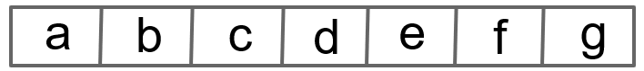
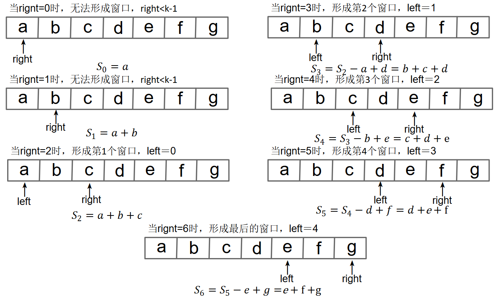
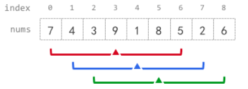

## 🌟 定长滑动窗口

## 定长滑动窗口介绍

### 1.什么是定长滑动窗口?
&emsp;&emsp;给定固定窗口长度k,在数组/字符串中，从左到右依次截取连续、长度严格不变的子区间，全程窗口大小不伸缩、不变化，仅整体向右平移（本质上是个双指针问题）。通俗类比：一辆定员为k人的公交车，每到一个站点，右边上新乘客，左边下旧乘客，保证车上人数始终为k。
### 2.窗口滑动原理演示
&emsp;&emsp;设定窗口k=3，原数组/字符串：\[a,b,c,d,e,f,g\]，原数组/字符串示意图如下：


&emsp;&emsp;初始化窗口:\[a,b,c\] → 统计总和 $S_1=a+b+c$

&emsp;&emsp;第一次滑动：去除最左侧a，新增右侧d → $S_2＝S_1-a+d$

&emsp;&emsp;第二次滑动：去除最左侧b，新增右侧e → $S_3＝S_2-b+e$

&emsp;&emsp;第三次...

### 3.通用解题步骤
#### step1：边界判断
&emsp;&emsp;若数组/字符串长度n<窗口长度k，无法形成合法窗口，直接返回默认值。

#### step2：初始化首个窗口
&emsp;&emsp;遍历前k个元素，完成窗口初始统计（题目要求的：例如求和、频次、集合等），并记录第一个窗口的结果。

#### step3：逐位滑动窗口(核心)
&emsp;&emsp;右指针从下标开始遍历到末尾，每次滑动执行三件事：

&emsp;&emsp;①**入窗**：纳入当前右指针新元素，更新窗口统计信息；

&emsp;&emsp;②**出窗**：移除窗口最左侧过期元素；

&emsp;&emsp;③**更新答案** ：对比全局最优解，更新结果。

#### step4：定长窗口核心公式
&emsp;&emsp;设右指针当前下标为right,左指针下标为left,

&emsp;&emsp;窗口长度为k，数组/字符串名称为arr:

&emsp;&emsp;①**待入窗口元素**：arr\[right\]

&emsp;&emsp;②**待出窗过期元素**：arr\[right-k\](核心公式，不能越界)

&emsp;&emsp;③**当前窗口左边界（左指针，left）下标**：right-k+1(因为在python中序号从0开始，可以参考上面的图)

&emsp;&emsp;④**窗口形成条件**：right>=k-1


### 4.Python万能通用模板

适配所有定长滑动窗口，只需根据题意修改窗口维护的数据结构即可。

```python
def fixed_window_template(arr,k):
    n = len(arr)
    # Step1:边界特判
    if n < k:
        return []# 根据题意修改返回值
    # Step2: 初始化窗口（核心可变部分，按需修改）
    window_sum = 0 # 场景1：数值求和
    # window_cnt = Counter() # 场景2：频次统计
    # window_set = set() # 场景3：去重判断
    # q = deque() # 场景4：单调队列求极值
    
    # 填充初始窗口
    for i in range(k):
        window_sum += arr[i]
    ans = window_sum # 初始答案
    
    # Step3：滑动窗口遍历剩余元素
    for right in range(k,n):#这里是直接从k开始的，也就是要求第一个left就是直接right-k,从0开始，python的索引是从0开始的，这里的k相当于窗口大小，那么第一个窗口的右端点索引就是k-1，现在直接开始往下滑了，开始第二个窗口了。
        # 1.新元素入窗
        window_sum += arr[right]
        # 2.旧元素出窗（核心公式）
        window_sum -= arr[right-k]
        # 3.更新最优答案
        ans = max(ans,window_sum) # 根据题意修改max、min、count
    return ans
```

### 5.例题（基础，题单参考力扣灵茶山艾府）
**[1456. 定长子串中元音的最大数目](https://leetcode.cn/problems/maximum-number-of-vowels-in-a-substring-of-given-length/description/)**

&emsp;&emsp;给你字符串 s 和整数 k。返回 s 中长度为 k 的子字符串包含的最大元音字母数。元音：a, e, i, o, u。
给你字符串s和整数k。返回s中长度为k 的子字符串包含的最大元音字母数。元音：a, e, i, o, u。

**示例**

|输入|输出|解释|
|---|---|---|
|s = "abciiidef", k = 3|3|子串 "iii" 含 3 个元音|
|s = "aeiou", k = 2|2|任意长度为 2 的子串都含 2 个元音|
|s = "leetcode", k = 3|2|"lee", "eet", "ode" 都含 2 个元音|
|s = "rhythms", k = 4|0|不含任何元音|
|s = "tryhard", k = 4|1|无|

```python
class Solution:
    def maxVowels(self, s, k):#s数组，k窗口大小
        ans = p_ans = 0 #初始化最终结果与当前结果
        for right, v in enumerate(s):  # 枚举窗口右端点right,enumerate遍历可迭代对象，同时返回下标索引与对应元素。
            # 1. 右端点进入窗口
            if v in "aeiou":#如果这个元素在元音里
                p_ans += 1

            left = right - k + 1  # 窗口左端点left这是直接打算推完整的left，与上面有一点区别，相当于是让right从1开始来倒推left，因为right=k-1时就形成了k大小的窗口了。
            if left < 0:  # 窗口长度不足 k，尚未形成第一个窗口
                continue #继续上面的操作

            # 2. 更新答案
            ans = max(ans, p_ans)

            # 3. 左端点离开窗口，为下一个循环做准备
            if s[left] in "aeiou":
                p_ans -= 1
        return ans

```

**[643\. 子数组最大的平均数](https://leetcode.cn/problems/maximum-average-subarray-i/)**

&emsp;&emsp;给你一个由 n 个元素组成的整数数组 nums 和一个整数 k 。请你找出平均数最大且 **长度为 k** 的连续子数组，并输出该最大平均数。任何误差小于 10-5 的答案都将被视为正确答案。

**示例**

| 输入 | 输出 | 解释 |
|------|------|------|
| nums = [1,12,-5,-6,50,3],k = 4 | 12.75 | 子数组 [2,5,5],[5,5,5] 和 [5,5,8] 的平均值分别为 4，5 和 6。其他长度为 3 的子数组平均值都小于 4（threshold 的值），最终最大平均值 = 12.75 |
| nums = [5], k = 1 | 5.00000 |无|


```python
import math#为了引入inf
class Solution(object):
    def findMaxAverage(self, nums, k):
        now_sum = now = 0 #初始化当前的和，与结果
        ans = float("-inf")#初始化无穷小，这样代码才能运行起来找大一点的
        for right,v in enumerate(nums):
            now_sum += v
            now = now_sum /k

            left = right - k + 1
            if left < 0 :
                continue

            ans = max(ans,now)

            now_sum -= nums[left]
        return ans
```

**[1343\. 大小为 k 且平均值大于等于阈值的子数组数目](https://leetcode.cn/problems/number-of-sub-arrays-of-size-k-and-average-greater-than-or-equal-to-threshold/)**

&emsp;&emsp;给你一个整数数组 arr 和两个整数 k 和 threshold 。请你返回长度为 k 且平均值大于等于 threshold 的子数组数目。

**示例**

|输入|输出|解释|
|---|---|---|
|arr = [2,2,2,2,5,5,5,8], k = 3,threshold = 4|3|子数组 [2,5,5],[5,5,5] 和 [5,5,8] 的平均值分别为4,5和6。其他长度为3的子数组的平均值都小于4（threshold 的值）。|
|arr = [11,13,17,23,29,31,7,5,2,3],k = 3,threshold = 5|6|前 6 个长度为 3 的子数组平均值都大于 5 。注意平均值不是整数。|


```python
class Solution:
    def numOfSubarrays(self,arr, k, threshold):
        ans = now = 0
        for right,v in enumerate(arr):
            now += v
            
            left = right - k + 1
            if left < 0:
                continue

            if now/k >= threshold:    
                ans += 1
            
            now -= arr[left]
        return ans
```

**[2090\. 半径为 k 的子数组平均值](https://leetcode.cn/problems/k-radius-subarray-averages/)**

&emsp;&emsp;给你一个下标从 **0** 开始的数组 nums ，数组中有 n 个整数，另给你一个整数 k。

&emsp;&emsp;**半径为 k 的子数组平均值** 是指：nums 中一个以下标 i 为 **中心** 且 **半径** 为 k 的子数组中所有元素的平均值，即下标在 i - k 和 i + k 范围（**含** i - k 和 i + k）内所有元素的平均值。如果在下标 i 前或后不足 k 个元素，那么 **半径为 k 的子数组平均值** 是 -1。
构建并返回一个长度为 n 的数组 avgs，其中 avgs[i] 是以下标 i 为中心的子数组的 **半径为 k 的子数组平均值**。
x 个元素的 **平均值** 是 x 个元素相加之和除以 x，此时使用截断式 **整数除法**，即需要去掉结果的小数部分。
例如，四个元素 2、3、1 和 5 的平均值是 (2 + 3 + 1 + 5) / 4 = 11 / 4 = 2.75，截断后得到 2。

**示例**


|输入|输出|解释|
|---|---|---|
|nums = [7,4,3,9,1,8,5,2,6], k = 3|[-1,-1,-1,5,4,4,-1,-1,-1]|avg[0]、avg[1] 和 avg[2] 是 -1 ，因为在这几个下标前的元素数量都不足k 个。中心为下标 3 且半径为 3 的子数组的元素总和是：7 + 4 + 3 + 9 + 1 + 8 + 5 = 37 。使用截断式 **整数除法**，avg[3] = 37 / 7 = 5 。中心为下标 4 的子数组，avg[4] = (4 + 3 + 9 + 1 + 8 + 5 + 2) / 7 = 4 。中心为下标 5 的子数组，avg[5] = (3 + 9 + 1 + 8 + 5 + 2 + 6) / 7 = 4 。avg[6]、avg[7] 和 avg[8] 是 -1 ，因为在这几个下标后的元素数量都不足 k 个。|
|nums = [100000], k = 0|[100000]|中心为下标 0 且半径 0 的子数组的元素总和是：100000 。 avg[0] = 100000 / 1 = 100000  |
|nums = [8],k = 100000|[-1]|avg[0] 是 -1 ，因为在下标 0 前后的元素数量均不足 k 。|

```python
class Solution:
    def getAverages(self, nums, k):
        ans = []
        act_k = 2 * k + 1
        now_ans = 0
        n = len(nums)
        for i, v in enumerate(nums):
            act_i = i + k # 以i为中心的窗口右边界下标
            if i < k : # 中心左侧不足k个元素，提前累加左侧半边数字
                now_ans += nums[i]
            if act_i < n: # 窗口右边界不越界，累加当前中心对应的右侧半边数字
                now_ans += nums[act_i]

            left = act_i - act_k + 1 # 当前窗口的左边界下标
            if left < 0 or act_i >= n: # 左边界不足 / 右边界越界，无法形成完整窗口
                ans.append(-1)
                continue
            ans.append(now_ans // act_k)
            # 移除当前窗口左边界元素，为下一轮窗口做准备
            now_ans -= nums[left]
        return ans
```

**[2379\. 得到 k 个黑块的最少涂色次数](https://leetcode.cn/problems/minimum-recolors-to-get-k-consecutive-black-blocks/description/)**

&emsp;&emsp;给你一个长度为 n 下标从 **0** 开始的字符串 blocks，blocks[i] 要么是 'W' 要么是 'B'，表示第 i 块的颜色。字符 'W' 和 'B' 分别表示白色和黑色。给你一个整数 k，表示想要 **连续** 黑色块的数目。每一次操作中，你可以选择一个白色块将它 **涂成** 黑色块。请你返回至少出现 **一次** 连续 k 个黑色块的 **最少** 操作次数。

**示例**

|输入|输出|解释|
|---|---|---|
|blocks = "WBBWWBBWBW", k = 7|3|一种得到 7 个连续黑色块的方法是把第 0 ，3 和 4 个块涂成黑色。得到 blocks = "BBBBBBBWBW" 。可以证明无法用少于 3 次操作得到 7 个连续的黑块。所以我们返回 3 。|
|blocks = "WBWBBBW", k = 2|0|不需要任何操作，因为已经有 2 个连续的黑块。所以我们返回 0 。|

```python
class Solution:
    def minimumRecolors(self, blocks: str, k: int) -> int:
        now_b = 0      # 当前窗口中黑色块的数量
        caozuo = 0     # 当前窗口中白色块的数量（即需要涂色的次数）
        now_c = float('inf')  # 记录最小操作数，初始化为无穷大
        
        for i, v in enumerate(blocks):
            # 右边进入窗口
            if v == "B":
                now_b += 1
            else:
                caozuo += 1
            
            left = i - k + 1
            
            # 窗口还没形成（元素不足k个）
            if left < 0:
                continue    
            
            # 更新最小值
            now_c = min(now_c, caozuo)
            
            # 左边移出窗口
            if blocks[left] == "B":
                now_b -= 1
            else:
                caozuo -= 1
        
        return now_c
```
**[2841\. 几乎唯一子数组的最大和](https://leetcode.cn/problems/maximum-sum-of-almost-unique-subarray/description/)**

&emsp;&emsp;给你一个整数数组 nums 和两个正整数 m 和 k 。
请你返回 nums 中长度为 k 的 几乎唯一 子数组的 最大和 ，如果不存在几乎唯一子数组，请你返回 0 。如果 nums 的一个子数组有至少 m 个互不相同的元素，我们称它是 几乎唯一 子数组。子数组指的是一个数组中一段连续 非空 的元素序列。

**示例**
|输入|输出|解释|
|---|---|---|
|`nums = [2,6,7,3,1,7], m = 3, k = 4`|`18`|总共有3个长度为`k=4`的几乎唯一子数组：`[2,6,7,3]`、`[6,7,3,1]`和`[7,3,1,7]`，其中和最大的是`[2,6,7,3]`，和为18|
|`nums = [5,9,9,2,4,5,4], m = 1, k = 3`|`23`|总共有5个长度为`k=3`的几乎唯一子数组：`[5,9,9]`、`[9,9,2]`、`[9,2,4]`、`[2,4,5]`和`[4,5,4]`，其中和最大的是`[5,9,9]`，和为23|
|`nums = [1,2,1,2,1,2,1], m = 3, k = 3`|`0`|不存在长度为`k=3`、包含至少`m=3`个互不相同元素的子数组，因此返回0|

```python
class Solution:
    def 
        return ans
```
    
---


