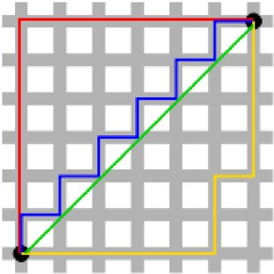
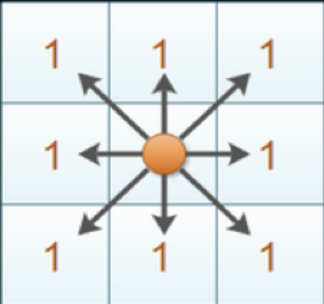

## 一、什么是 KNN 近邻算法
### 1.1 KNN 核心思想：邻里投票机制
&emsp;&emsp;KNN 是典型的监督学习，核心逻辑一句话概括：物以类聚。
把所有样本映射到多维特征空间，预测时计算待测样本与全部训练样本的距离，选出距离最近的 K 个邻居。分类任务采用少数服从多数投票，占比最高的类别作为预测结果；回归则取邻居标签均值输出。


### 1.2 KNN 属于监督学习的原因
&emsp;&emsp;KNN属于典型监督学习，核心依据有三点：一是依赖带标注的训练数据，投票预测必须依靠样本真实标签，无标签则无法完成预测；二是拟合特征与标签的映射关系，通过带标签样本隐性构建特征空间与标签的对应规律；三是适配监督学习核心任务，可完成分类、回归两类监督学习经典任务。
### 1.3 KNN 适用场景：分类与回归任务
&emsp;&emsp;KNN无数据分布假设、逻辑简洁，同时支持分类和回归任务，适配中小维度、样本量适中的场景，两类核心应用场景概括如下：

一、分类任务

&emsp;&emsp;通过K个近邻样本投票判定离散类别，是KNN主流应用场景，适用于文本分类、图像简单识别、用户画像分类、故障判别等低维度、数据分布均匀的场景。优势是对异常数据不敏感、适配小样本；劣势是高维数据计算效率低。

二、回归任务

&emsp;&emsp;通过计算K个近邻样本标签的平均值，预测连续型数值，适用于房价预测、销量预估、温度拟合、用户评分预测等场景。整体适配非线性、无固定规律的小幅波动数据，缺点是对极端数值拟合效果较差。

## 二、KNN 核心数学：距离度量方式
KNN 判断样本相似的核心依靠距离计算，不同距离公式适配不同数据分布，下面介绍工业最常用的度量。


### 2.1 闵可夫斯基距离（通用统一框架）
&emsp;&emsp;是欧氏、曼哈顿、切比雪夫距离的通用公式，三者都是它取不同参数下的特例。
$$d=\left(\sum_{i=1}^n |x_i - y_i|^p \right)^{\frac{1}{p}}$$
- $p=1$：曼哈顿距离
- $p=2$：欧氏距离
- $p\to\infty$：切比雪夫距离
&emsp;&emsp;优点：一套公式覆盖三种基础距离；缺点：依旧对特征量纲敏感，高维数据效果下滑。

### 2.2 欧氏距离（最常用）
&emsp;&emsp;直观理解为多维空间中两点的直线长度，综合全部特征维度的差异，是KNN默认首选距离。
n 维特征计算公式：
$$d = \sqrt{\sum_{i=1}^{n} (x_i - y_i)^2}$$
&emsp;&emsp;优点：符合人类直观认知；缺点：对特征量纲、极端异常值敏感，使用前必须做标准化，否则取值范围大的特征会完全主导距离结果。

### 2.3 曼哈顿距离


&emsp;&emsp;又称城市街区距离，类比网格街道只能横、竖行走，无法走斜线，累加每一维特征差值的绝对值,如图红蓝黄都是曼哈顿距离，绿色为欧式距离。
计算公式：
$$d=\sum_{i=1}^n |x_i - y_i|$$
&emsp;&emsp;优点：无平方开根运算，计算速度更快，轻微噪声、异常值对结果影响更小；缺点：同等放大所有维度的差值，不适合需要权衡特征权重的场景。

### 2.4 切比雪夫距离


&emsp;&emsp;也叫棋盘距离，类比国际象棋国王移动，一步能覆盖任意相邻方向，两点最小步数等于差距最大的特征维度。
公式如下：
$$d=\max_{i=1\dots n}|x_i - y_i|$$
&emsp;&emsp;逻辑上只看重差异最突出的那一维特征，其余维度微小差距直接忽略。适合单特征起决定性作用的数据，但缺陷明显：极易被单个极端特征值干扰整体相似度判断。

除了以上介绍的几种距离公式还有**余弦距离**、**杰卡德距离**、**马氏距离**、**汉明距离**等。

### 2.5 不同距离公式适用场景对比
1. **闵可夫斯基距离**
通用框架，调p切换曼哈顿/欧氏/切比雪夫；通过调整p快速测试不同距离对模型的影响，适合初步探索。
2. **欧氏距离**
综合全部维度差异，通用性最强；适合特征尺度统一、无明显极端噪声的常规数据集，绝大多数KNN默认选择。
3. **曼哈顿距离**
计算开销更低，小幅异常值鲁棒性更强；适合高维稀疏、尺度差异大、带少量噪声的数据。
4. **切比雪夫距离**
仅关注维度最大差值；仅用于单一项特征就能区分样本、其余维度波动无关紧要的特殊业务。


## 三、关键超参数 K 值选择
### 3.1 K 值核心含义
K：近邻样本数量

&emsp;&emsp;对一个待预测样本，在全部训练数据里，找出距离它最近的 K 个样本，依据这 K 个邻居投票 / 均值做预测：

- 分类任务：K 个邻居里哪一类样本最多，待预测样本就归为该类；

- 回归任务：取 K 个邻居标签的平均值作为预测值。

**K=5 时KNN分类完整实例演示**

**3.1.1 场景设定**

- 样本分为两类：类别A（圆形）、类别B（方形）
- $X$：待预测的测试样本点
- 超参数 $K=5$：选取距离测试点最近的5个训练样本，采用**少数服从多数**投票规则判定类别
- 距离计算使用欧氏距离，按距离由近到远排序邻居

**3.1.2 5个近邻明细**

| 距离排名（由近→远） | 邻居所属类别 |
| ---- | ---- |
| 1 | A |
| 2 | A |
| 3 | B |
| 4 | A |
| 5 | B |

**3.1.3 投票统计**

- 类别A：第1、2、4号邻居，共 **3票**
- 类别B：第3、5号邻居，共 **2票**

**3.1.4预测结果**

&emsp;&emsp;3票 > 2票，多数类别为A，因此预测测试点 $X$ 属于**类别A**

**3.1.5拓展对比：不同K值带来不同预测结果**

（1）K=1（只取最近1个样本）仅保留排名第1的邻居，类别为A，预测结果A。
> 缺点：极易受噪声、异常点干扰，模型容易过拟合。

（2）K=9（扩大邻近范围）在原有5个邻居基础上再增加4个更远样本（假设在扩大范围后，新增的4个更远样本全部为B类）。
总票数：A=3，B=6，预测结果变为B。
> 缺点：引入远处无关样本，丢失局部特征，模型欠拟合。

**3.1.6 补充：为什么K优先选择奇数**

&emsp;&emsp;若设置 $K=4$，假设近邻分布为2个A、2个B，票数持平，出现平局无法判定类别；选用奇数K（针对硬投票KNN）可从根源避免投票平局问题。

**3.1.7 拓展：KNN回归任务举例（无投票，取均值）**

&emsp;&emsp;若任务为回归，不进行投票，直接取K个邻居标签平均值作为预测值。假设K=5的邻居标签数值：$[2,4,4,6,9]$ $$\mathrm{预测值} = \frac{2+4+4+6+9}{5} = 5$$
### 3.2 如何选取最优 K 值

&emsp;&emsp;通常采用交叉验证（如K折交叉验证）结合网格搜索，选取验证集误差最小、泛化能力最强的K值。绘制不同K值下的误差曲线，选择误差曲线的拐点（肘部）作为最优K也是常用技巧。

### 3.3 加权 KNN：解决近邻权重差异

**3.3.1 普通KNN存在的缺陷**

&emsp;&emsp;标准KNN对K个近邻**同等权重投票**，存在明显不合理问题：距离测试点很近的样本、距离很远的样本，投票权重完全一样。远处无关样本容易干扰预测结果，降低模型精度。

举例：K=5，3个极近的A类样本、2个很远的B类样本，普通KNN投票A=3、B=2，预测A；但2个B距离极远，参考价值极低，同等投票会引入偏差。

**3.3.2 加权KNN核心思想**
给每个近邻分配**和距离负相关的权重**：
- 离测试点越近 → 权重越大，投票话语权更高
- 离测试点越远 → 权重越小，投票话语权被削弱

**3.3.3 常用权重计算公式**

（1）倒数权重（最常用）
$$
w_i = \frac{1}{d(x, x_i)}
$$
$d(x,x_i)$：测试样本$x$ 与第$i$个近邻$x_i$ 的距离
若距离$d=0$（样本完全重合），直接令$w_i=1$避免分母为0

（2） 距离倒数平方权重
$$
w_i = \frac{1}{d(x, x_i)^2}
$$
放大远近权重差距，更远样本权重衰减更快

（3） 高斯核权重（平滑衰减）
$$
w_i = \exp\left(-\frac{d(x,x_i)^2}{2\sigma^2}\right)
$$

**3.3.4 加权投票规则（分类任务）**

不再统计样本个数，而是**累加对应类别所有权重**：
1. 遍历K个近邻，计算每个样本权重$w_i$
2. 按类别分组累加权重总和
3. 权重总和最大的类别，作为最终预测类别

**实操举例（K=5）**

设测试点5个近邻信息：

| 邻居序号 | 类别 | 距离d | 权重 $w=1/d$ |
| ---- | ---- | ---- | ---- |
| 1 | A | 0.5 | 2.00 |
| 2 | A | 0.8 | 1.25 |
| 3 | B | 4.0 | 0.25 |
| 4 | A | 1.0 | 1.00 |
| 5 | B | 5.0 | 0.20 |

权重求和：
- A总权重：$2.00 + 1.25 + 1.00 = 4.25$
- B总权重：$0.25 + 0.20 = 0.45$

$4.25 > 0.45$，预测样本为类别A。

对比普通KNN：同样预测A，但加权机制大幅压低了远距离B样本的干扰。

**3.3.5 加权KNN回归任务**

预测值为K个样本标签的**加权平均值**：

$$
\hat{y} = \frac{\sum_{i=1}^K w_i \cdot y_i}{\sum_{i=1}^K w_i}
$$

$y_i$：第$i$个邻居真实标签；$w_i$：对应权重

**3.3.6 加权KNN优缺点**

（1）优点
1. 解决普通KNN远近邻居权重均等的不合理问题；
2. 降低远距离噪声样本对预测的干扰；
3. 决策边界更平滑，泛化性能通常优于标准KNN。

（2）缺点
1. 计算量上升：需要额外计算每个样本的权重；
2. 对异常点极度靠近测试点的场景会过度倾斜结果。

**3.3.7 适用场景**

&emsp;&emsp;样本分布不均匀、近邻距离差异大的数据，优先选用加权KNN。

## 六、代码调用
> **注意**：使用KNN前务必对特征进行标准化（如 `StandardScaler`），否则量纲大的特征会主导距离计算，严重影响预测效果。
- 分类 KNeighborsClassifier
```Python
# 导入
from sklearn.neighbors import KNeighborsClassifier
# 初始化模型
knn_clf = KNeighborsClassifier(n_neighbors=5) # k=5
# 训练
knn_clf.fit(X_train, y_train)
# 预测
y_pred = knn_clf.predict(X_test)
# 概率预测
y_proba = knn_clf.predict_proba(X_test)
```
- 回归 KNeighborsRegressor
```Python
from sklearn.neighbors import KNeighborsRegressor
knn_reg = KNeighborsRegressor(n_neighbors=3)
knn_reg.fit(X_train, y_train)
y_pred = knn_reg.predict(X_test)
```
# 七、KNN 优缺点总结
## 7.1 算法优势
1. 原理简单直观，实现门槛低，无需复杂训练流程；
2. 惰性学习，无需显式训练过程，新增样本只需加入数据集，无需重新训练；
3. 不预设数据分布，适配线性、非线性各类分类场景；
4. 天然支持多分类（无需像SVM那样采用一对一或一对多策略），预测结果可通过邻近样本直观解释。

## 7.2 算法局限性
1. 预测耗时高（尤其当训练集较大或特征维度较高时），海量数据实时推理效率差；
2. 存在维度灾难，高维数据距离失去区分效果；
3. 对特征量纲敏感，使用前必须做归一化处理；
4. 样本不平衡、噪声、异常值会严重影响精度；
5. 全量存储训练样本，内存占用高；
6. K 值需反复调优，过小易过拟合、过大易欠拟合。

&emsp;&emsp;⭐欢迎常来做客，有任何想法都可以留言、内容错误欢迎指出，期待和各位一同交流。

--- 
