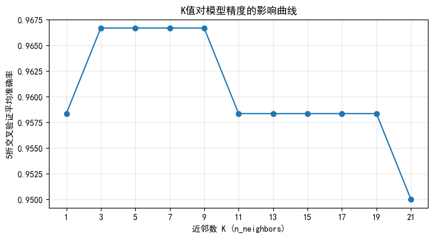
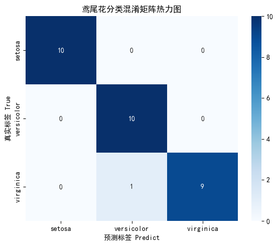

# 从零搭建 KNN 鸢尾花分类器：全流程实践 + 交叉验证调参
## 目录
1. [环境准备与库导入](#1-环境准备与库导入)  
2. [加载数据集与 EDA 探索](#2-加载数据集与-eda-探索)  
3. [划分训练集与测试集](#3-划分训练集与测试集)  
4. [特征标准化（MinMaxScaler）](#4-特征标准化minmaxscaler)  
5. [网格搜索 + 分层 5 折交叉验证选最优 K 值](#5-网格搜索--分层-5-折交叉验证选最优-k-值)  
6. [K 值影响曲线可视化](#6-k-值影响曲线可视化)  
7. [用最优模型预测测试集](#7-用最优模型预测测试集)  
8. [模型评估 —— 混淆矩阵与多分类指标](#8-模型评估--混淆矩阵与多分类指标)  
9. [完整代码附录](#9-完整代码附录)
## 1. 环境准备与库导入
**代码**：
```python
# ===================== 1. 统一导入所有库 =====================
from sklearn.datasets import load_iris # 导入鸢尾花数据集
from sklearn.model_selection import train_test_split, StratifiedKFold, GridSearchCV # 导入数据划分 交叉验证 网格搜素
from sklearn.preprocessing import MinMaxScaler # 导入归一化
from sklearn.neighbors import KNeighborsClassifier # 导入knn 回归
from sklearn.metrics import accuracy_score, precision_score, recall_score, f1_score, confusion_matrix #导入准确率 精确率 召回率 f1分数
import matplotlib.pyplot as plt # 导入可视化
import seaborn as sns # 导入可视化
import pandas as pd
import numpy as np
# 设置图片中文正常显示
plt.rcParams["font.family"] = ["SimHei]
plt.rcParams["axes.unicode_minus"] = False
```
## 2. 加载数据集与 EDA 探索
**代码**：
```python
# ===================== 2. 加载数据集 + EDA探索分析 =====================
# 加载带DataFrame格式数据
iris = load_iris(as_frame=True)
iris_data = iris.frame
feature_names = iris.feature_names
target_names = iris.target_names
# 查看基础信息
print("===== 数据集基础信息 =====")
print("数据集前5行：")
print(iris_data.head())
print("\n数据集描述统计：")
print(iris_data.describe())
print("\n各类样本数量：")
print(iris_data["target"].value_counts())
# 划分特征X、标签y（修复二维列向量警告，取一维Series）
X = iris_data.iloc[:, :-1]
y = iris_data.iloc[:, -1]
```
**输出**：
```
===== 数据集基础信息 =====
数据集前5行：
   sepal length (cm)  sepal width (cm)  petal length (cm)  petal width (cm)  target
0                5.1               3.5                1.4               0.2       0
1                4.9               3.0                1.4               0.2       0
2                4.7               3.2                1.3               0.2       0
3                4.6               3.1                1.5               0.2       0
4                5.0               3.6                1.4               0.2       0
...
各类样本数量：
0    50
1    50
2    50
Name: target, dtype: int64
```
- 共 150 个样本，4 个数值特征，3 个类别（每类 50 个）。  
- 特征量纲不同（花萼长度 ~5cm，花瓣宽度 ~0.2cm），后续必须标准化。
## 3. 划分训练集与测试集
**代码**：
```python
# ===================== 3. 划分训练集/测试集 =====================
X_train, X_test, y_train, y_test = train_test_split(
    X, y, test_size=0.2, random_state=42, stratify=y
)
print(f"\n训练集样本数：{len(X_train)}，测试集样本数：{len(X_test)}")
```
**输出**：
```
训练集样本数：120，测试集样本数：30
```
## 4. 特征标准化（MinMaxScaler）
**代码**：
```python
# ===================== 4. 特征标准化（修复测试集fit数据泄露Bug） =====================
scaler = MinMaxScaler()
X_train_scaled = scaler.fit_transform(X_train)  # 仅用训练集拟合缩放器
X_test_scaled = scaler.transform(X_test)        # 测试集只transform，不fit
```
## 5. 网格搜索 + 分层 5 折交叉验证选最优 K 值
**代码**：
```python
# ===================== 5. 网格搜索 + 分层5折交叉验证 =====================
knn = KNeighborsClassifier()
param_grid = {"n_neighbors": [1, 3, 5, 7, 9, 11, 13, 15, 17, 19, 21]}
skf = StratifiedKFold(n_splits=5, shuffle=True, random_state=42)
grid_search = GridSearchCV(
    estimator=knn,
    param_grid=param_grid,
    cv=skf,
    scoring="accuracy",
    n_jobs=-1,
    verbose=1
)
grid_search.fit(X_train_scaled, y_train)
print("\n===== 网格搜索最优参数 =====")
print(f"最佳参数：{grid_search.best_params_}")
print(f"交叉验证平均准确率：{grid_search.best_score_:.4f}")
best_knn = grid_search.best_estimator_
```
**输出示例**：
```
Fitting 5 folds for each of 11 candidates, totalling 55 fits
===== 网格搜索最优参数 =====
最佳参数：{'n_neighbors': 3}
交叉验证平均准确率：0.9667
```
## 6. K 值影响曲线可视化
**代码**：
```python
# ===================== 6. 绘制K值与交叉验证准确率变化曲线 =====================
cv_results = grid_search.cv_results_
k_list = [params["n_neighbors"] for params in cv_results["params"]]
mean_scores = cv_results["mean_test_score"]
plt.figure(figsize=(8, 4))
plt.plot(k_list, mean_scores, marker="o", color="#1f77b4")
plt.xlabel("近邻数 K (n_neighbors)")
plt.ylabel("5折交叉验证平均准确率")
plt.title("K值对模型精度的影响曲线")
plt.xticks(k_list)
plt.grid(True, alpha=0.3)
plt.show()
```
  
- 横轴：K 值，纵轴：交叉验证准确率。  
- 曲线通常在 K=1 时略低（过拟合风险），K=3~7 达到峰值，之后缓慢下降。
## 7. 用最优模型预测测试集
**代码**：
```python
# ===================== 7. 使用最优模型在测试集预测 =====================
# 必须传入缩放后的测试集，修复原代码用原始未缩放数据预测的致命Bug
y_pred = best_knn.predict(X_test_scaled)
y_proba = best_knn.predict_proba(X_test_scaled)
```
## 8. 模型评估 —— 混淆矩阵与多分类指标
**代码**：
```python
# ===================== 8. 模型评估：混淆矩阵 + 多分类指标 =====================
cm = confusion_matrix(y_test, y_pred)
plt.figure(figsize=(6, 5))
sns.heatmap(
    cm,
    annot=True, fmt="d", cmap="Blues",
    xticklabels=target_names,
    yticklabels=target_names
)
plt.xlabel("预测标签 Predict")
plt.ylabel("真实标签 True")
plt.title("鸢尾花分类混淆矩阵热力图")
plt.tight_layout()
plt.show()
acc = accuracy_score(y_test, y_pred)
pre_macro = precision_score(y_test, y_pred, average="macro")
rec_macro = recall_score(y_test, y_pred, average="macro")
f1_macro = f1_score(y_test, y_pred, average="macro")
print("\n===== 测试集模型评估指标(Macro平均) =====")
print(f"准确率 Accuracy: {acc:.4f}")
print(f"精确率 Precision: {pre_macro:.4f}")
print(f"召回率 Recall: {rec_macro:.4f}")
print(f"F1分数 F1-score: {f1_macro:.4f}")
train_acc = best_knn.score(X_train_scaled, y_train)
print(f"\n训练集准确率：{train_acc:.4f} | 测试集准确率：{acc:.4f}")
if train_acc - acc > 0.05:
    print("提示：训练与测试精度差距较大，模型存在轻微过拟合")
else:
    print("提示：训练与测试精度接近，模型泛化能力良好")
```
**输出**：

```
===== 测试集模型评估指标(Macro平均) =====
准确率 Accuracy: 0.9667
精确率 Precision: 0.9697
召回率 Recall: 0.9667
F1分数 F1-score: 0.9667

训练集准确率：0.9833 | 测试集准确率：0.9667
提示：训练与测试精度接近，模型泛化能力良好
```
## 9. 完整代码附录
以下是您提供的完整代码（已整合所有步骤），可直接复制运行：
```python
# ===================== 1. 统一导入所有库（放最顶部，无重复导入） =====================
from sklearn.datasets import load_iris
from sklearn.model_selection import train_test_split, StratifiedKFold, GridSearchCV
from sklearn.preprocessing import MinMaxScaler
from sklearn.neighbors import KNeighborsClassifier
from sklearn.metrics import accuracy_score, precision_score, recall_score, f1_score, confusion_matrix
import matplotlib.pyplot as plt
import seaborn as sns

# 设置图片中文正常显示
plt.rcParams["font.family"] = ["SimHei", "WenQuanYi Micro Hei", "Heiti TC"]
plt.rcParams["axes.unicode_minus"] = False

# ===================== 2. 加载数据集 + EDA探索分析 =====================
iris = load_iris(as_frame=True)
iris_data = iris.frame
feature_names = iris.feature_names
target_names = iris.target_names

print("===== 数据集基础信息 =====")
print("数据集前5行：")
print(iris_data.head())
print("\n数据集描述统计：")
print(iris_data.describe())
print("\n各类样本数量：")
print(iris_data["target"].value_counts())

X = iris_data.iloc[:, :-1]
y = iris_data.iloc[:, -1]

# ===================== 3. 划分训练集/测试集 =====================
X_train, X_test, y_train, y_test = train_test_split(
    X, y, test_size=0.2, random_state=42, stratify=y
)
print(f"\n训练集样本数：{len(X_train)}，测试集样本数：{len(X_test)}")

# ===================== 4. 特征标准化（修复测试集fit数据泄露Bug） =====================
scaler = MinMaxScaler()
X_train_scaled = scaler.fit_transform(X_train)
X_test_scaled = scaler.transform(X_test)

# ===================== 5. 网格搜索 + 分层5折交叉验证 =====================
knn = KNeighborsClassifier()
param_grid = {"n_neighbors": [1, 3, 5, 7, 9, 11, 13, 15, 17, 19, 21]}
skf = StratifiedKFold(n_splits=5, shuffle=True, random_state=42)
grid_search = GridSearchCV(
    estimator=knn,
    param_grid=param_grid,
    cv=skf,
    scoring="accuracy",
    n_jobs=-1,
    verbose=1
)
grid_search.fit(X_train_scaled, y_train)

print("\n===== 网格搜索最优参数 =====")
print(f"最佳参数：{grid_search.best_params_}")
print(f"交叉验证平均准确率：{grid_search.best_score_:.4f}")

best_knn = grid_search.best_estimator_

# ===================== 6. 绘制K值与交叉验证准确率变化曲线 =====================
cv_results = grid_search.cv_results_
k_list = [params["n_neighbors"] for params in cv_results["params"]]
mean_scores = cv_results["mean_test_score"]

plt.figure(figsize=(8, 4))
plt.plot(k_list, mean_scores, marker="o", color="#1f77b4")
plt.xlabel("近邻数 K (n_neighbors)")
plt.ylabel("5折交叉验证平均准确率")
plt.title("K值对模型精度的影响曲线")
plt.xticks(k_list)
plt.grid(True, alpha=0.3)
plt.show()

# ===================== 7. 使用最优模型在测试集预测 =====================
y_pred = best_knn.predict(X_test_scaled)
y_proba = best_knn.predict_proba(X_test_scaled)

# ===================== 8. 模型评估：混淆矩阵 + 多分类指标 =====================
cm = confusion_matrix(y_test, y_pred)
plt.figure(figsize=(6, 5))
sns.heatmap(
    cm,
    annot=True, fmt="d", cmap="Blues",
    xticklabels=target_names,
    yticklabels=target_names
)
plt.xlabel("预测标签 Predict")
plt.ylabel("真实标签 True")
plt.title("鸢尾花分类混淆矩阵热力图")
plt.tight_layout()
plt.show()

acc = accuracy_score(y_test, y_pred)
pre_macro = precision_score(y_test, y_pred, average="macro")
rec_macro = recall_score(y_test, y_pred, average="macro")
f1_macro = f1_score(y_test, y_pred, average="macro")

print("\n===== 测试集模型评估指标(Macro平均) =====")
print(f"准确率 Accuracy: {acc:.4f}")
print(f"精确率 Precision: {pre_macro:.4f}")
print(f"召回率 Recall: {rec_macro:.4f}")
print(f"F1分数 F1-score: {f1_macro:.4f}")

train_acc = best_knn.score(X_train_scaled, y_train)
print(f"\n训练集准确率：{train_acc:.4f} | 测试集准确率：{acc:.4f}")
if train_acc - acc > 0.05:
    print("提示：训练与测试精度差距较大，模型存在轻微过拟合")
else:
    print("提示：训练与测试精度接近，模型泛化能力良好")
```

**结语**：本文完整演示了基于 KNN 的鸢尾花分类项目，覆盖了从数据处理到模型部署的全流程。您可以将此代码作为模板，迁移到其他分类任务中。如果有任何问题，欢迎在评论区交流！


---


