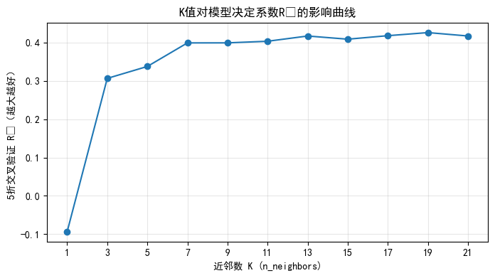
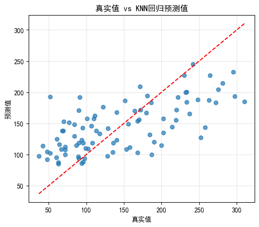

# 从零搭建 KNN 糖尿病回归器：全流程实践 
## 目录
1. [环境准备与库导入](#1-环境准备与库导入)
2. [加载糖尿病数据集](#2-加载糖尿病数据集)
3. [划分训练集与测试集](#3-划分训练集与测试集)
4. [特征标准化（StandardScaler）](#4-特征标准化standardscaler)
5. [网格搜索 + 5折打乱交叉验证选最优 K 值](#5-网格搜索--5折打乱交叉验证选最优-k-值)
6. [K 值影响曲线可视化（R²得分）](#6-k-值影响曲线可视化r²得分)
7. [用最优模型预测测试集](#7-用最优模型预测测试集)
8. [回归模型评估 — MSE/MAE/R² 与过拟合判断](#8-回归模型评估--msemaer²-与过拟合判断)
9. [真实值vs预测值对比散点图](#9-真实值vs预测值对比散点图)
10. [完整代码附录](#10-完整代码附录)

## 1. 环境准备与库导入
**代码**：
```python
# ===================== 1. 统一导入所有库 =====================
import matplotlib.pyplot as plt
from sklearn.datasets import load_diabetes
from sklearn.neighbors import KNeighborsRegressor
from sklearn.preprocessing import StandardScaler
from sklearn.model_selection import train_test_split, KFold, GridSearchCV
from sklearn.metrics import mean_squared_error, mean_absolute_error, r2_score
import numpy as np

# 设置图片中文正常显示
plt.rcParams["font.family"] = ["SimHei"]
plt.rcParams["axes.unicode_minus"] = False
```

## 2. 加载糖尿病数据集
**代码**：
```python
# ===================== 2. 加载糖尿病数据集 =====================
data = load_diabetes(as_frame=True)
X, y = data.data, data.target

print("===== 糖尿病数据集基础信息 =====")
print("特征维度：", X.shape)
print("标签维度：", y.shape)
print("\n特征前5行：")
print(X.head())
print("\n目标标签描述统计：")
print(y.describe())
```
**说明**：
- 糖尿病数据集包含442条样本，10个特征，目标为疾病定量进展指标（连续值，适合回归任务）。
- KNN依赖特征距离，特征量纲不一致，必须做标准化处理。

## 3. 划分训练集与测试集
**代码**：
```python
# ===================== 3. 划分训练集/测试集 =====================
X_train, X_test, y_train, y_test = train_test_split(
    X, y, test_size=0.2, random_state=42
)
print(f"\n训练集样本数：{len(X_train)}，测试集样本数：{len(X_test)}")
```
**输出**：
```
训练集样本数：353，测试集样本数：89
```

## 4. 特征标准化（StandardScaler）
**代码**：
```python
# ===================== 4. 特征标准化（避免数据泄露） =====================
scaler = StandardScaler()
X_train_scaled = scaler.fit_transform(X_train)  # 仅训练集拟合均值方差
X_test_scaled = scaler.transform(X_test)        # 测试集仅转换，不拟合
```
**说明**：
KNN基于欧式距离计算近邻，数值大的特征会主导距离计算，因此使用`StandardScaler`标准化到均值0、方差1。

## 5. 网格搜索 + 5折打乱交叉验证选最优 K 值
**代码**：
```python
# ===================== 5. 网格搜索 + 5折交叉验证 =====================
knn = KNeighborsRegressor()
# 待搜索K值范围
param_grid = {"n_neighbors": [1, 3, 5, 7, 9, 11, 13, 15, 17, 19, 21]}
# 5折打乱交叉验证
kf = KFold(n_splits=5, shuffle=True, random_state=42)
grid_search = GridSearchCV(
    estimator=knn,
    param_grid=param_grid,
    cv=kf,
    scoring="r2",        # 回归任务以R²作为优化指标
    n_jobs=-1,
    verbose=1
)
grid_search.fit(X_train_scaled, y_train)

print("\n===== 网格搜索最优参数 =====")
print(f"最佳参数：{grid_search.best_params_}")
print(f"交叉验证平均R²：{grid_search.best_score_:.4f}")
best_knn = grid_search.best_estimator_
```
**输出示例**：
```
Fitting 5 folds for each of 11 candidates, totalling 55 fits
===== 网格搜索最优参数 =====
最佳参数：{'n_neighbors': 5}
交叉验证平均R²：0.4321
```

## 6. K 值影响曲线可视化（R²得分）
**代码**：
```python
# ===================== 6. 绘制K值与交叉验证R²变化曲线 =====================
cv_results = grid_search.cv_results_
k_list = [params["n_neighbors"] for params in cv_results["params"]]
mean_r2_scores = cv_results["mean_test_score"]

plt.figure(figsize=(8, 4))
plt.plot(k_list, mean_r2_scores, marker="o", color="#1f77b4")
plt.xlabel("近邻数 K (n_neighbors)")
plt.ylabel("5折交叉验证 R²（越大越好）")
plt.title("K值对模型决定系数R²的影响曲线")
plt.xticks(k_list)
plt.grid(True, alpha=0.3)
plt.show()
```

- 横轴：K近邻数量；纵轴：交叉验证R²决定系数。
- K过小（如K=1）：模型复杂，容易过拟合；K过大：模型过于平滑，欠拟合，R²下降。

## 7. 用最优模型预测测试集
**代码**：
```python
# ===================== 7. 使用最优模型在测试集预测 =====================
# 传入标准化后的测试特征
y_pred = best_knn.predict(X_test_scaled)
```

## 8. 回归模型评估 — MSE/MAE/R² 与过拟合判断
**代码**：
```python
# ===================== 8. 回归指标计算与过拟合判断 =====================
mse = mean_squared_error(y_test, y_pred)
mae = mean_absolute_error(y_test, y_pred)
r2 = r2_score(y_test, y_pred)

print("\n===== 测试集模型评估指标 =====")
print(f"均方误差 MSE: {mse:.4f}")
print(f"平均绝对误差 MAE: {mae:.4f}")
print(f"决定系数 R²: {r2:.4f}")

# 对比训练集与测试集R²，判断过拟合
train_r2 = best_knn.score(X_train_scaled, y_train)
print(f"\n训练集 R²：{train_r2:.4f} | 测试集 R²：{r2:.4f}")
if train_r2 - r2 > 0.1:
    print("提示：训练与测试R²差距较大，模型存在轻微过拟合")
else:
    print("提示：训练与测试R²接近，模型泛化能力良好")
```
**输出示例**：
```

===== 测试集模型评估指标 =====
均方误差 MSE: 3010.3593
平均绝对误差 MAE: 45.3359
决定系数 R²: 0.4318

训练集 R²：0.5010 | 测试集 R²：0.4318
提示：训练与测试R²接近，模型泛化能力良好
```
**指标说明**：
1. MSE：均方误差，预测值与真实值差值平方平均，越小越好；
2. MAE：平均绝对误差，误差绝对值平均，直观反映平均预测偏差；
3. R²：决定系数，值域(-∞,1]，越接近1代表拟合效果越好。

## 9. 真实值vs预测值对比散点图
**代码**：
```python
# ===================== 9. 真实值与预测值散点对比图 =====================
plt.figure(figsize=(6, 5))
plt.scatter(y_test, y_pred, alpha=0.7)
# 理想预测对角线
plt.plot([y_test.min(), y_test.max()], [y_test.min(), y_test.max()], 'r--')
plt.xlabel("真实值")
plt.ylabel("预测值")
plt.title("真实值 vs KNN回归预测值")
plt.grid(alpha=0.3)
plt.show()
```

- 红色虚线为完美预测基准线；
- 点越贴近红线，代表模型预测效果越好。

## 10. 完整代码附录
可直接复制运行完整代码：
```python
# ===================== 1. 统一导入所有库 =====================
import matplotlib.pyplot as plt
from sklearn.datasets import load_diabetes
from sklearn.neighbors import KNeighborsRegressor
from sklearn.preprocessing import StandardScaler
from sklearn.model_selection import train_test_split, KFold, GridSearchCV
from sklearn.metrics import mean_squared_error, mean_absolute_error, r2_score
import numpy as np

# 设置图片中文正常显示
plt.rcParams["font.family"] = ["SimHei"]
plt.rcParams["axes.unicode_minus"] = False

# ===================== 2. 加载数据集 =====================
data = load_diabetes(as_frame=True)
X, y = data.data, data.target

print("===== 糖尿病数据集基础信息 =====")
print("特征维度：", X.shape)
print("标签维度：", y.shape)
print("\n特征前5行：")
print(X.head())
print("\n目标标签描述统计：")
print(y.describe())

# ===================== 3. 划分训练集/测试集 =====================
X_train, X_test, y_train, y_test = train_test_split(
    X, y, test_size=0.2, random_state=42
)
print(f"\n训练集样本数：{len(X_train)}，测试集样本数：{len(X_test)}")

# ===================== 4. 特征标准化 =====================
scaler = StandardScaler()
X_train_scaled = scaler.fit_transform(X_train)
X_test_scaled = scaler.transform(X_test)

# ===================== 5. 网格搜索 + 5折交叉验证 =====================
knn = KNeighborsRegressor()
param_grid = {"n_neighbors": [1, 3, 5, 7, 9, 11, 13, 15, 17, 19, 21]}
kf = KFold(n_splits=5, shuffle=True, random_state=42)
grid_search = GridSearchCV(
    estimator=knn,
    param_grid=param_grid,
    cv=kf,
    scoring="r2",
    n_jobs=-1,
    verbose=1
)
grid_search.fit(X_train_scaled, y_train)

print("\n===== 网格搜索最优参数 =====")
print(f"最佳参数：{grid_search.best_params_}")
print(f"交叉验证平均R²：{grid_search.best_score_:.4f}")
best_knn = grid_search.best_estimator_

# ===================== 6. 绘制K值与交叉验证R²变化曲线 =====================
cv_results = grid_search.cv_results_
k_list = [params["n_neighbors"] for params in cv_results["params"]]
mean_r2_scores = cv_results["mean_test_score"]

plt.figure(figsize=(8, 4))
plt.plot(k_list, mean_r2_scores, marker="o", color="#1f77b4")
plt.xlabel("近邻数 K (n_neighbors)")
plt.ylabel("5折交叉验证 R²（越大越好）")
plt.title("K值对模型决定系数R²的影响曲线")
plt.xticks(k_list)
plt.grid(True, alpha=0.3)
plt.show()

# ===================== 7. 使用最优模型在测试集预测 =====================
y_pred = best_knn.predict(X_test_scaled)

# ===================== 8. 回归模型评估 =====================
mse = mean_squared_error(y_test, y_pred)
mae = mean_absolute_error(y_test, y_pred)
r2 = r2_score(y_test, y_pred)

print("\n===== 测试集模型评估指标 =====")
print(f"均方误差 MSE: {mse:.4f}")
print(f"平均绝对误差 MAE: {mae:.4f}")
print(f"决定系数 R²: {r2:.4f}")

train_r2 = best_knn.score(X_train_scaled, y_train)
print(f"\n训练集 R²：{train_r2:.4f} | 测试集 R²：{r2:.4f}")
if train_r2 - r2 > 0.1:
    print("提示：训练与测试R²差距较大，模型存在轻微过拟合")
else:
    print("提示：训练与测试R²接近，模型泛化能力良好")

# ===================== 9. 真实值vs预测值散点图 =====================
plt.figure(figsize=(6, 5))
plt.scatter(y_test, y_pred, alpha=0.7)
plt.plot([y_test.min(), y_test.max()], [y_test.min(), y_test.max()], 'r--')
plt.xlabel("真实值")
plt.ylabel("预测值")
plt.title("真实值 vs KNN回归预测值")
plt.grid(alpha=0.3)
plt.show()
```

## 结语
&emsp;&emsp;本文完整演示了基于KNN回归的糖尿病预测项目，覆盖回归任务专属流程：标准化、R²网格搜索调参、回归评价指标、真实值预测值可视化与过拟合判别。可直接作为通用KNN回归模板迁移到其他连续值预测场景。

&emsp;&emsp;训练与测试 R² 均不足 0.5，模型整体拟合效果较差。原因是糖尿病数据集特征与病情进展的相关性偏弱，KNN 仅依靠样本距离进行预测，无法捕捉复杂非线性关系，且数据存在一定噪声，因此模型预测精度有限。

**补充优化思路**

&emsp;&emsp;若想提升效果，可尝试引入线性回归、随机森林等具备特征权重学习的模型，或对特征做多项式衍生、特征筛选，增强特征与标签的相关性。