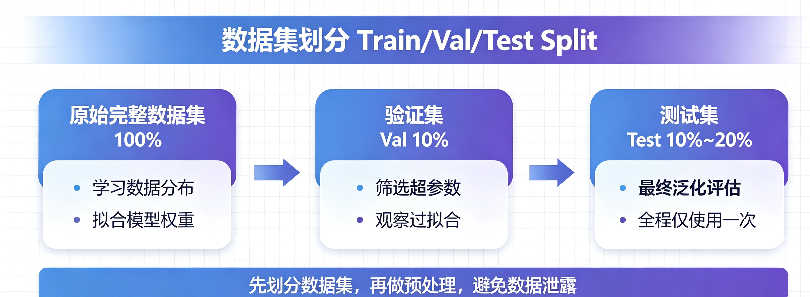
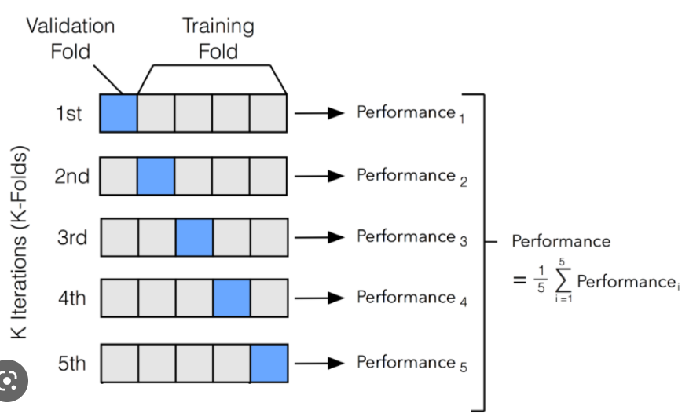
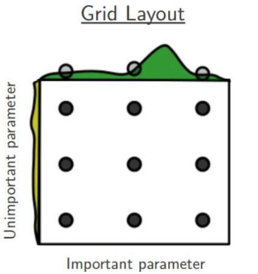
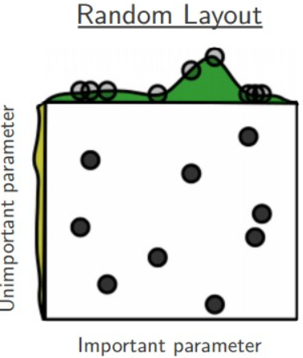

# 机器学习建模细节：数据准备、特征放缩、交叉验证、参数优化
## 一、数据准备：数据清洗与数据集划分）
### 1. 数据集划分 Train/Val/Test Split
#### 1.1 三集合分工

完整建模流程需将数据拆为三份：
- **训练集（Train）**：学习数据分布，拟合权重，占比最大（70%~80%）；
- **验证集（Val）**：监控训练效果，筛选超参数，判断过拟合；
- **测试集（Test）**：最终泛化能力客观评分，全程仅用一次，严禁参与训练、调参或预处理。

#### 1.2 核心铁律：先划分，后归一化
- 错误做法：全量数据先缩放再划分 → 测试集信息泄露，分数虚高；
- 正确流程：原始数据 → 划分三集 → 仅用训练集计算缩放参数 → 同步转换验证集与测试集。

#### 1.3 划分比例参考
- 中小数据集：7:1:2（训练70%、验证10%、测试20%）
- 大数据集（十万级以上）：95:2.5:2.5，可压缩验证/测试占比
- 分类任务务必使用**分层划分**，保证各类别分布一致。

#### 1.4 补充实操要点
1. 划分前打乱数据（时序数据除外，需按时间切分，防未来泄露）；
2. 测试集全程封存，所有调参与验证仅用训练+验证集。

#### 1.4 代码调用
使用 `sklearn.model_selection.train_test_split`，先拆测试集，再拆验证集，分层保证类别均衡。

函数原型：
```python
train_test_split(*arrays, test_size=None, train_size=None, random_state=None, shuffle=True, stratify=None)
```
- **`*arrays`**：待划分数据（X, y），同步切分，顺序对应。
- **`test_size`** / **`train_size`**：浮点数（比例）或整数（样本数），二者选一，默认 test_size=0.25。
- **`random_state`**：固定种子保证可复现。
- **`shuffle`**：是否打乱（静态数据 True，时序数据 False）。
- **`stratify`**：传入标签 y，分类任务必用，保持类别比例。

```python
import pandas as pd
from sklearn.model_selection import train_test_split

df = pd.read_csv("data.csv")
X = df.drop("target", axis=1)
y = df["target"]

# 第一步：拆分测试集（20%），分层
X_train_val, X_test, y_train_val, y_test = train_test_split(X, y, test_size=0.2, random_state=42, stratify=y)

# 第二步：从训练验证集中再拆验证集（总比例 70% 训练，10% 验证）
X_train, X_val, y_train, y_val = train_test_split(X_train_val, y_train_val, test_size=0.125, random_state=42, stratify=y_train_val)
```
### 2. 缺失值填充 Imputation

#### 2.1 缺失三大机制（决定填充方法）
- **MCAR（完全随机缺失）**：与自身及他特征无关（如设备随机故障）→ 少量可删除或简单填充。
- **MAR（随机缺失，最常见）**：缺失由其他特征决定（如低收入者不填收入）→ 不能直接删，需填充。
- **MNAR（非随机缺失）**：缺失与自身值相关（如高收入者隐瞒收入）→ 填充易失真，优先业务补录。

#### 2.2 检测缺失值
```python
import pandas as pd
import missingno as msno
import numpy as np

df = pd.read_csv("data.csv")
print(df.isnull().sum())                     # 每列缺失总数
print(df.isnull().sum() / len(df) * 100)    # 缺失占比(%)
msno.matrix(df)   # 缺失矩阵图
msno.bar(df)      # 缺失柱状图
```
**缺失率处理参考**：
- < 5%：可删除样本（MCAR）；
- 5%~30%：推荐填充；
- 50%：信息过少，建议直接删除该列。

#### 2.3 常见填充方法
- **删除法**：`df.dropna(axis=0)`（缺失极少且 MCAR）
- **常数填充**：`fillna(0)` 或 `fillna("未知")`（缺失有业务含义）
- **均值/中位数填充**：`fillna(df.mean())`（无异常值用均值，有极值用中位数）
- **众数填充**（分类）：`df['brand'].mode()[0]`
- **时序插值**（时间序列）：`ffill`、`bfill`、`interpolate(method='linear')`
- **模型填充**：KNN、IterativeImputer（高精度，适合中小数据或竞赛）

**各类填充方法对比**：

| 填充方法 | 优点 | 缺点 | 适用场景 |
| ---- | ---- | ---- | ---- |
| 删除法 | 无篡改分布 | 损失样本 | 缺失极少、MCAR |
| 常数填充 | 简单快速 | 扭曲分布 | 缺失有业务含义 |
| 均值填充 | 运算快 | 压缩方差 | 无异常值的平稳特征 |
| 中位数填充 | 抗异常值 | 忽略趋势 | 存在离群值的数值列 |
| 线性插值 | 保持时序规律 | 仅适用有序连续数据 | 时序/传感器数据 |
| KNN 填充 | 利用特征关联 | 大数据慢 | 中小数据集、相关性高 |
| 迭代模型填充 | 精度最高 | 计算开销大 | 机器学习建模/竞赛 |

### 3. 类别特征编码 One-Hot / Label Encoding
机器学习模型无法处理字符串，需将离散类别转为数值。常用两种编码：

#### 3.1 Label Encoding（标签编码）
- **原理**：将类别按字典序映射为整数（0,1,2,...）。
- **适用**：**有序分类特征**（学历、等级、年龄段），模型识别大小关系。
- 示例：学历 ["大专","本科","硕士","博士"] → [0,1,2,3]。
```python
from sklearn.preprocessing import LabelEncoder
le = LabelEncoder()
df["education_encode"] = le.fit_transform(df["education"])
```

#### 3.2 One-Hot Encoding（独热编码）
- **原理**：为每个类别新建 0/1 列，属于该类为 1，其余为 0。
- **适用**：**无序分类特征**（城市、品类、性别），消除虚假大小关系。
- 示例：城市 ["北京","上海","广州"] → city_北京, city_上海, city_广州。
- **注意**：独热编码输出为二元稀疏特征，无需再标准化/归一化；建议删除一列避免多重共线性。
```python
# pandas 快速独热编码
df_onehot = pd.get_dummies(df["city"], prefix="city")
df = pd.concat([df, df_onehot], axis=1)
```

#### 3.3 两种编码对比

|编码方式|适用特征|输出形式|优缺点|
|---|---|---|---|
|Label Encoding|有序分类（学历、等级）|单列整数|不增维度；不可用于无序特征|
|One-Hot Encoding|无序分类（城市、品类）|多列 0/1|无虚假大小关系；高基数易维度爆炸|

## 二、特征缩放：标准化、归一化与稳健缩放方案选型
特征缩放统一量纲，避免大数值特征主导模型，常用三种方案：

### 1. Z-score 标准化（Standardization）
- **公式**：$z = (x-\mu)/\sigma$，变换后均值为0，标准差1，无固定区间。
- **适用**：近似正态分布、无边界特征（薪资、身高）；适合线性回归、逻辑回归、PCA、神经网络等。
- **缺点**：对异常值敏感。
```python
from sklearn.preprocessing import StandardScaler
scaler = StandardScaler()
df["value_std"] = scaler.fit_transform(df[["value"]])
```

### 2. MinMax 归一化（Normalization）
- **公式**：$x_{new} = (x-x_{min})/(x_{max}-x_{min})$，映射到 [0,1]。
- **适用**：有边界数据（像素、评分）、距离敏感算法（KNN、SVM、聚类）、深度学习。
- **缺点**：极端依赖最大/最小值，对异常值极敏感。
```python
from sklearn.preprocessing import MinMaxScaler
scaler = MinMaxScaler()
df["value_norm"] = scaler.fit_transform(df[["value"]])
```

### 3. 稳健缩放（RobustScaler）
- **原理**：基于中位数和四分位数，不受极值影响。
- **适用**：含大量异常值的工业/金融/传感器数据。
```python
from sklearn.preprocessing import RobustScaler
scaler = RobustScaler()
df["value_robust"] = scaler.fit_transform(df[["value"]])
```

### 4. 三种缩放方案选型总结

|缩放方式|区间|抗异常值|核心适用场景|
|---|---|---|---|
|Z-score 标准化|无固定区间|弱|正态分布、常规建模、PCA|
|MinMax 归一化|[0,1]|极弱|有边界数据、KNN/SVM/深度学习|
|Robust 稳健缩放|无固定区间|极强|含异常值的噪声数据|

# 三、模型评估：交叉验证策略与任务评价指标

### 1. K折交叉验证（K-Fold CV）

- **原理**：数据均匀分 K 份，轮流取 1 份作验证，其余训练，迭代 K 次，取平均分。
- **作用**：消除划分随机性，提升泛化评估可靠性，适合所有任务。
```python
from sklearn.model_selection import KFold, cross_val_score
kf = KFold(n_splits=5, shuffle=True, random_state=42)
scores = cross_val_score(model, X, y, cv=kf)
```

### 2. 分层K折交叉验证（Stratified K-Fold）
- **原理**：保证每折的类别分布与原数据集一致。
- **适用**：**仅分类任务**，尤其样本不均衡时，为标准验证方案。
```python
from sklearn.model_selection import StratifiedKFold
skf = StratifiedKFold(n_splits=5, shuffle=True, random_state=42)
scores = cross_val_score(model, X, y, cv=skf)
```

### 3. 建模评价指标（Metrics）

**3.1 分类任务指标**（混淆矩阵：TP, FP, TN, FN）
- **混淆矩阵**：通过矩阵形式展示模型在预测时的正确与错误分类情况。
- **准确率（Accuracy）**：$\frac{TP+TN}{TP+TN+FP+FN}$，适合均衡样本。
- **精确率（Precision）**：$\frac{TP}{TP+FP}$，侧重减少误判。
- **召回率（Recall）**：$\frac{TP}{TP+FN}$，侧重减少漏判。
- **F1-Score**：$\frac{2 \times Precision \times Recall} {Precision + Recall}$，平衡前两者。
- 多分类需加 average 参数：average='macro'/'micro'/'weighted'
```Python
from sklearn.metrics import accuracy_score, precision_score, recall_score, f1_score, confusion_matrix
import numpy as np
# 真实标签、预测标签
y_true = [0, 1, 0, 1, 1, 0]
y_pred = [0, 1, 1, 1, 0, 0]
# 1. 混淆矩阵（TP TN FP FN）
cm = confusion_matrix(y_true, y_pred)
# 二分类拆分TP,FP,TN,FN
tn, fp, fn, tp = cm.ravel()
# 2. 准确率 Accuracy
acc = accuracy_score(y_true, y_pred)
# 3. 精确率 Precision（二分类默认pos_label=1）
pre = precision_score(y_true, y_pred)
# 4. 召回率 Recall
rec = recall_score(y_true, y_pred)
# 5. F1-Score
f1 = f1_score(y_true, y_pred)
```
**3.2 回归任务指标**（$y_i$真实，$\hat{y_i}$预测，$\bar{y}$均值）
- **MSE**：$\frac{1}{n}\sum (y_i - \hat{y_i})^2$，对大误差惩罚强。
- **RMSE**：$\sqrt{MSE}$，量纲与原始数据一致。
- **MAE**：$\frac{1}{n}\sum |y_i - \hat{y_i}|$，抗异常值。
- **R²**：$1 - \frac{\sum (y_i - \hat{y_i})^2}{\sum (y_i - \bar{y})^2}$，解释力，越近1越好。
```Python
from sklearn.metrics import mean_squared_error, mean_absolute_error, r2_score
import math
# 1. MSE 均方误差
mse = mean_squared_error(y_true, y_pred)
# 2. RMSE 均方根误差（MSE开根号）
rmse = math.sqrt(mse)
# 新版sklearn可直接 mean_squared_error(y_true, y_pred, squared=False)
rmse2 = mean_squared_error(y_true, y_pred, squared=False)
# 3. MAE 平均绝对误差
mae = mean_absolute_error(y_true, y_pred)
# 4. R² 决定系数
r2 = r2_score(y_true, y_pred)
```
**3.3 指标与调参关联**：

&emsp;&emsp;超参数优化以指标为目标（分类最大化F1/准确率，回归最小化MSE/最大化R²）。

## 四、超参数调优：网格、随机与贝叶斯优化对比
超参数寻优分两类：**采样遍历**（无记忆）和**优化算法迭代**（有记忆、智能搜索）。

### 1. 网格搜索 GridSearchCV

- **原理**：穷举预设参数所有组合，交叉验证选最优。
- **适用**：低维参数、候选值少、算力充足。
- **优缺点**：保证找到预设内最优，但组合爆炸，高维不适用。
```python
from sklearn.model_selection import GridSearchCV
param_grid = {"n_estimators": [100, 200], "max_depth": [3, 5, 7]}
grid = GridSearchCV(estimator=model, param_grid=param_grid, cv=5)
grid.fit(X_train, y_train)
```

### 2. 随机搜索 RandomizedSearchCV

- **原理**：在参数空间随机采样固定组合。
- **适用**：参数较多、范围宽、算力有限，用于快速粗筛。
- **优缺点**：速度快，易跳出局部，但可能错过全局最优。
```python
from sklearn.model_selection import RandomizedSearchCV
import scipy.stats as stats
param_dist = {"n_estimators": stats.randint(50, 500), "max_depth": stats.randint(2, 12)}
rand_search = RandomizedSearchCV(model, param_distributions=param_dist, n_iter=30, cv=5)
rand_search.fit(X_train, y_train)
```

### 3. 贝叶斯优化（Optuna）
- **原理**：利用历史结果构建概率模型，迭代预测高潜力参数区域，智能缩小搜索范围。
- **适用**：高维参数、训练耗时模型、追求高精度（竞赛/工程）。
- **优缺点**：收敛快、迭代少，但逻辑稍复杂，依赖第三方库。
```python
import optuna
from sklearn.ensemble import RandomForestClassifier

def objective(trial):
    params = {
        "n_estimators": trial.suggest_int("n_estimators", 50, 500),
        "max_depth": trial.suggest_int("max_depth", 2, 12)
    }
    model = RandomForestClassifier(**params)
    return cross_val_score(model, X_train, y_train, cv=5).mean()

study = optuna.create_study(direction="maximize")
study.optimize(objective, n_trials=30)
print(study.best_params)
```

**三种调参方案对比**

|调优方法|搜索逻辑|计算速度|适用场景|
|---|---|---|---|
|网格搜索 GridSearchCV|穷举全部组合|最慢|低维、候选值少|
|随机搜索 RandomizedSearchCV|随机采样|中等|参数多、粗筛范围|
|贝叶斯优化 Optuna|基于历史智能预测|最快|高维、耗时模型、高精度|

&emsp;&emsp;⭐欢迎常来做客，有任何想法都可以留言、内容错误欢迎指出，期待和各位一同交流。


---